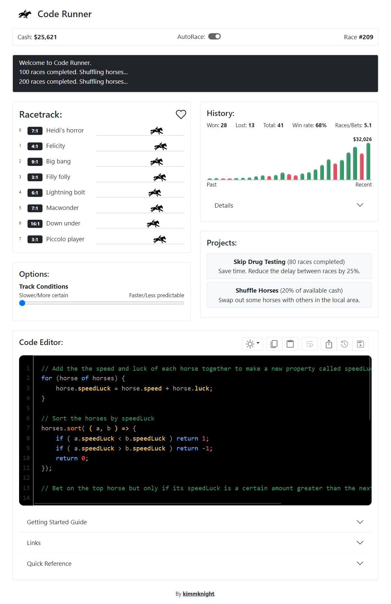

###  Code Runner

Code Runner is a horse race betting game where you write JavaScript code to bet on horses and win cash.

Your aim is make as much cash as possible by writing the best code possible to win.

Various projects/upgrades will become available as you progress.

#### Play

You can play the game at https://kimmknight.github.io/CodeRunner

#### Images

#### About

Code Runner is an evolution of my previous project [Horse Racer](https://kimmknight.github.io/HorseRacer/) which is a tribute to the 1986 Mac game *Horse Race*.

Code Runner is still in an experimental stage of development.

Currently, there are only a limited number of projects/upgrades. I would like to add many more and perhaps a prestige feature.

I am also still tweaking parameters relating to speed and randomness to try and make the game well balanced.

#### Help

There is a Getting Started Guide and Quick Reference available in-game.

You might also want to check out [code snippets](https://kimmknight.github.io/CodeRunner/docs/docs.html?doc=codesnippets.md).

If the game loads a blank page, try deleting the *coderunner-game* item from your browser's local storage.
